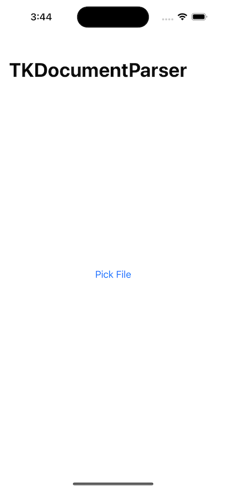
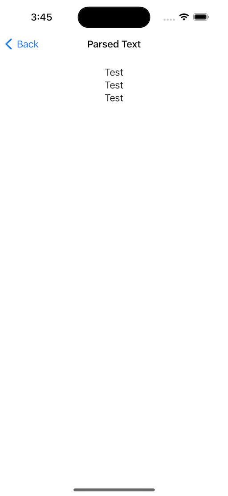

# TKDocumentParserDemo
`TKDocumentParser` is a Swift package designed to simplify the process of extracting plain text from various document formats, including **PDF** and **DOCX**. 

This is example demo.

## Screenshot





## Example

```swift
import TKDocumentParser

do {
        let url = // your local file path
        let text = try TKDocumentParser.parseText(from: url)
        print("extractedText: \(text)")
} catch {
        print(error.localizedDescription)    
}
```